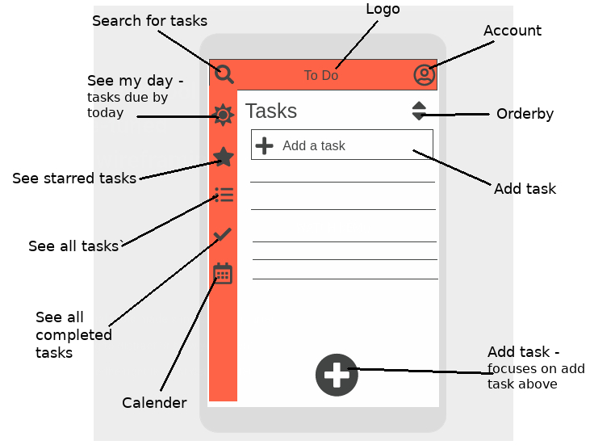

# ✔️ JS Tasker 😮‍💨

Create yourself a todo list and keep it forever. Built on ApolloServer, GraphQL and React!

<hr/>

## Register

Pass a username and password to create an account

```
mutation register($username: String!, $password: String!){
  addUser(username: $username, password: $password){
    username
    passwordHash
  }
}
```

Variables

```
{
  "username": "drnobody",
  "password": "password5"
}
```

<hr/>

## Login

Pass username and password to get authorization token.

```
mutation login($username: String!, $password: String!){
  login(username: $username, password: $password){
    value
  }
}
```

Variables

```
{
  "username": "drnobody",
  "password": ""password5"
}
```

Return

```
{
  "data": {
    "login": {
      "value": "eyJhbGciOiJIUzI1NiIsInR5cCI6IkpXVCJ9.KG9cK8W_yyr2g69CSz5TT3bIVhUoG2luhH8gsvjPVSo......."
    }
  }
}
```

Be sure to include the enture authorization token in future requests.

```
{
  "Authorization": "Bearer "eyJhbGciOiJIUzI1NiIsInR5cCI6IkpXVCJ9.KG9cK8W_yyr2g69CSz5TT3bIVhUoG2luhH8gsvjPVSo......."
}
```

<hr/>

## Create a Task

Pass come content, maybe a due date and if its priority.

```
mutation addTask($content: String!, $due: String, $priority: Boolean){
  addTask(content: $content, due: $due, priority: $priority){
    id
    content
    created
    due
    priority
    complete
    late
    user
    {
      username
    }
  }
}
```

Variables

```
{
  "content": "Write a README.md",
  "due": "1612118070418"
}
```

Return

```
{
  "data": {
    "addTask": {
      "id": "6016f9307df15611b67f48d5",
      "content": "Write a README.md",
      "created": "1612117421569",
      "due": "1612118070418",
      "priority": false,
      "complete": false,
      "late": false,
      "user": {
        "username": "supergreg"
      }
    }
  }
}
```

## Dashboard

This is where the magic happens, should you decide to sell your soul.


